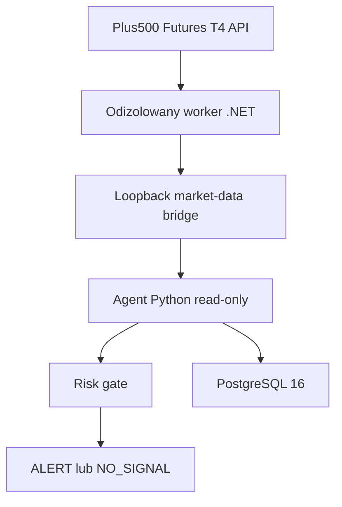

# Architektura T4-only

Worker .NET ma połączenie SSL do T4 i prywatne dane sesji. Agent Python widzi
jedynie znormalizowane świece, cenę referencyjną i metadane atestacji. Endpointy
zleceń nie mogą być wystawione przez most.

Most jest dostępny tylko przez loopback i wymaga osobnego tokenu. Adapter odrzuca
zdalny host, credentials w URL, redirect, błędny source ID, brak rzeczywistego
contract ID, wygasły kontrakt, niepełną historię i nie-UTC timestamps.

Katalog kontraktów 0.4.0 jest wczytywany lokalnie przez worker. Resolver sortuje
serie według wygaśnięcia, używa front-month wyłącznie przed jego `roll_at` i od
tej granicy wymaga następnej bezpiecznej serii. Payload schema v2 przenosi
`contract_roll_at`, typ wyboru oraz `rolled_from_contract_id`, więc agent Python
może odrzucić brakującą lub sfałszowaną proweniencję rollu.

Oficjalna dokumentacja wymaga rejestracji aplikacji przed logowaniem do T4 API.
Dlatego host 0.3.0 pozostaje `NOT_READY` i zwraca `503`, dopóki oficjalny klient
nie zostanie podłączony. Ten stan prowadzi w agencie do `NO_SIGNAL`.

PostgreSQL rozdziela historię migracji od aktywnej polityki. `t4_runtime_config`
jest append-only i jednoznacznie wymusza wyłączone order routes.
