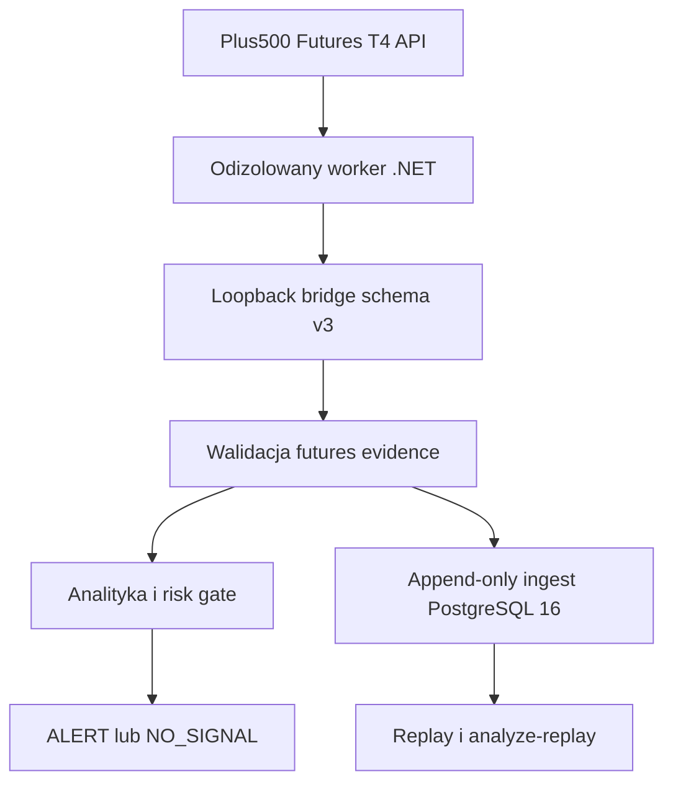

# Architektura T4-only

Worker .NET jest przygotowaną granicą dla połączenia SSL do T4 i prywatnych danych
sesji. Oficjalny klient nie jest jeszcze podłączony: bieżący
`T4ApplicationRegistrationPendingReader` zwraca `503`. Agent Python widzi jedynie
znormalizowane dane rynkowe i metadane atestacji. Endpointy zleceń nie mogą być
wystawione przez most.

Most jest dostępny tylko przez loopback i wymaga osobnego tokenu. Adapter odrzuca
zdalny host, credentials w URL, redirect, błędny source ID, brak rzeczywistego
contract ID, wygasły kontrakt, niepełną historię i nie-UTC timestamps.

Katalog kontraktów jest wczytywany lokalnie przez worker. Resolver sortuje
serie według wygaśnięcia, używa front-month wyłącznie przed jego `roll_at` i od
tej granicy wymaga następnej bezpiecznej serii. Payload schema v3 przenosi
`contract_roll_at`, typ wyboru, `rolled_from_contract_id` oraz `futures_evidence`.
Evidence wiąże batch z pełnym snapshotem order booka, statusem sesji, typed basis
reference i opcjonalnym dowodem przejścia kontraktu.

Oficjalna dokumentacja wymaga rejestracji aplikacji przed logowaniem do T4 API.
Dlatego host pozostaje `NOT_READY` i zwraca `503`, dopóki oficjalny klient nie
zostanie podłączony. Ten stan prowadzi w agencie do `NO_SIGNAL`. Fixture’y
testowe nie są źródłem live i nie omijają tej granicy.

PostgreSQL rozdziela historię migracji od aktywnej polityki. `t4_runtime_config`
jest append-only i jednoznacznie wymusza wyłączone order routes.

Warstwa 0.5.0 zapisuje dokładne bajty odpowiedzi bridge’a wraz z SHA-256 oraz
znormalizowane świece w jednej transakcji. Konflikt identycznego hasha zwraca
istniejący batch, nie tworząc kolejnych świec. Replay otwiera transakcję tylko do
odczytu i uwzględnia wyłącznie rekordy znane w zadanym `as_of`; brak pełnego okna
kończy się `T4_REPLAY_INCOMPLETE`, a nie częściowym wynikiem.

Warstwa 0.6.0 waliduje schema v3 i oblicza deterministycznie spread, depth,
imbalance, basis, annualized basis, metryki wolumenu, ryzyko expiry i wpływ rollu.
Basis może korzystać wyłącznie z referencji typu `index` o source ID
`plus500_t4_index_v1`; zwykła cena futures nie może jej zastąpić. Brak, stary lub
niespójny dowód kończy się `NO_SIGNAL`.

Migracja `0015` zapisuje snapshot, poziomy order booka i dowód przejścia kontraktu
jako append-only, wraz z hashami kanonicznej treści. Point-in-time replay odtwarza
ten sam evidence i obejmuje go fingerprintem wejścia; `analyze-replay` przepuszcza
go przez ten sam silnik co analiza bieżąca. Historyczne batche schema v2 są nadal
odczytywalne, ale bez futures evidence nie mogą przejść bramki analitycznej.

Raport 0.6.0 zawiera również scenariusze bull/base/bear, przeciwne dowody i warunki
unieważnienia. `v1_gate_passed` pozostaje `false`; kolejną warstwą jest monitoring
i alert delivery z punktu 7.
