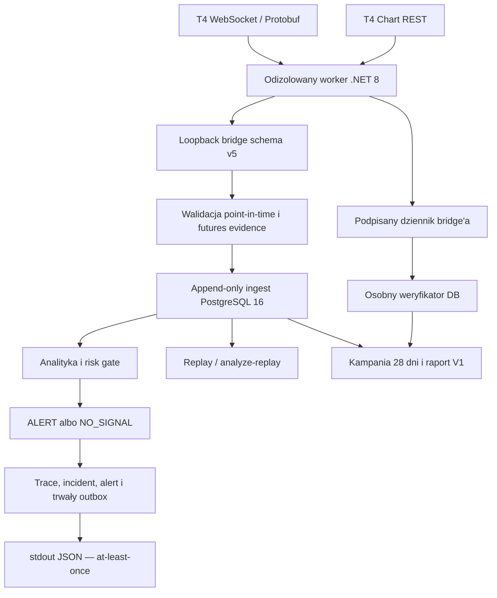

# Architektura T4-only

## Granica T4

Worker .NET 8 korzysta z oficjalnych `Plus500US.T4Proto` `1.0.73` i
`Plus500US.T4ChartDecoder` `1.0.97` oraz publicznego protokołu przypiętego do
commita
`1a68b674482194f1cf3b9d7f129ce5fbed8bcb51`. WebSocket dostarcza logowanie,
heartbeat i Market By Price depth; binarna odpowiedź Chart REST jest dekodowana
oficjalnym decoderem do zamkniętych świec.

Reader ma ograniczoną listę wiadomości wychodzących: login, heartbeat i
subskrypcja depth. Nie ma order routes. Po rozłączeniu czyści cache, łączy się
ponownie i odtwarza subskrypcje. Health staje się `READY` dopiero po uwierzytelnieniu,
potwierdzeniu uprawnień i prewarmie danych futures, indeksu oraz historii.

`T4_API_ENVIRONMENT` wybiera jeden z wbudowanych endpointów `simulator`, `live`
albo bezpieczny stan `pending`. Odpowiednio atestowany envelope ma
`t4_simulator`, `live_t4` lub nie jest dostępny. Simulator nie jest live i nie
może tworzyć zewnętrznej dostawy alertu.

Implementacja nie zastępuje testu na przydzielonym koncie. Klucz API,
uprawnienia, rzeczywiste identyfikatory rynków oraz niezależny indeks basis są
zależnościami zewnętrznymi. Brak któregokolwiek elementu prowadzi do `503` i
`NO_SIGNAL`, a nie do danych zastępczych.

## Schema v5 i tożsamość rynku

Schema bridge `v5` rozdziela `ExchangeID`, produktowy `ContractID` i
nieprzezroczysty `MarketID` handlowalnej serii. Katalog kontraktów przechowuje
bieżące oraz następne serie i niezależną tożsamość rynku indeksowego. `MarketID`
nie jest parsowany ani konstruowany, a każda świeca zachowuje własną wartość
zwróconą przez Chart REST. Dzięki temu historia obejmująca roll nie przypisuje
starej świecy do bieżącej serii.

Resolver wybiera serię wyłącznie przed jej `roll_at`, a potem wymaga następnej.
W ograniczonym oknie rollu evidence wiąże zsynchronizowane snapshoty starego i
nowego `MarketID`. Basis wymaga osobnego rynku typu `index` ze źródła
`plus500_t4_index_v1`; cena lub tożsamość futures nie może zastępować indeksu.

Walidacja point-in-time obejmuje `observed_at`, `available_at`, `ingested_at`,
cutoff zapytania, pełny nieprzecięty order book, status sesji i zgodność wszystkich
tożsamości. Niepełny cache, spóźnione dane, brak indeksu lub niespójny roll kończą
się fail-closed.

## Ingest, replay i monitoring

Migracje `0014`–`0018` tworzą append-only ścieżkę danych. Batch zachowuje dokładny
payload i SHA-256, świece zachowują `MarketID`, a snapshot, poziomy order booka i
transition evidence mają osobne hashe. Replay korzysta tylko z rekordów
`available_at <= as_of`; brak pełnego okna oznacza `T4_REPLAY_INCOMPLETE`.
Historyczne schema v2-v4 pozostają odczytywalne zgodnie z ich ograniczeniami, ale
replay nigdy nie kwalifikuje się do external delivery.

Tylko niewygasła decyzja `ALERT` z schema v5, `environment=live_t4`, kompletnym
evidence i przejściem risk gate może utworzyć rekord outboxa. `NO_SIGNAL`, veto,
stale, synthetic, fixture, replay, Simulator i provider error są wykluczone.

Research run/artifact, alert, event i outbox powstają w jednej transakcji
PostgreSQL. Wyjście `stdout_json` → `process_stdout` ma semantykę at-least-once;
odbiorca deduplikuje po `idempotency_key`. System nie obiecuje exactly-once na
granicy procesu.

## Odbiór V1

Migracja `0017` dodaje niezmienny baseline kampanii, append-only cykle i zdarzenia
sesji, ochronę przed deklarowaniem cykli z wyprzedzeniem/backfillem oraz niezmienny
raport końcowy. Czas startu, statusu i końca pochodzi z PostgreSQL.

Migracja `0018` dodaje etap 1 dowodów scenariuszy. Bridge utrwala kanoniczne
zdarzenia w trwałym JSONL, łączy je globalnym hash chain i podpisuje własnym
kluczem ECDSA P-256. Jest to podpis naszego bridge'a, nie podpis T4 ani Plus500.

Python przypina fingerprint SPKI zamrożony w baseline, sprawdza podpis i claims,
a potem zapisuje zdarzenie przez osobny login weryfikatora. PostgreSQL ponownie
sprawdza klucz, hashe, łańcuch, okno kampanii i referencje do realnych batchy,
cykli i runów. Caller nie ma parametru pozwalającego zadeklarować `PASS`.

Polityka wymaga minimum `672` godzin czasu rzeczywistego, pokrycia zamrożonych
scope’ów, progów prób i sukcesu, limitów luk i RTT, braku naruszeń read-only oraz
zaliczenia obowiązkowych scenariuszy. Raport można finalizować dopiero po
`planned_ends_at + cycle_interval_seconds`. Status każdego kryterium to `PASS`,
`FAIL` albo `NOT_OBSERVED`.

Niezależna funkcja PostgreSQL wylicza bramkę bez użycia caller-computed statusów.
Wymaga wszystkich siedmiu scenariuszy `pass`. Kontrolowany `rate_limit` dowodzi
naszej ścieżki handlera, nie vendorowego `429`. Pasywny `roll_transition` wymaga
prawdziwego rollu live; brak rollu nie może zostać zastąpiony injectorem.

Zakres kampanii `0.9.0` jest zamrożony na BTC/ETH 4h. Standardowy
dwutygodniowy Simulator nie pokrywa 28 dni. `observe-start` wykonuje live preflight
każdego scope’u. `observe-run` pobiera dokładnie jeden live batch należnego slotu,
utrwala go i analizuje ten sam zamknięty obiekt; wygasłe sloty zapisuje wyłącznie
jako `missed`, bez backfillu.

UUID kampanii, klucz bridge'a i pusty dziennik muszą być wybrane przed startem
bridge'a i nowe dla każdej kampanii. PostgreSQL ma trzy osobne loginy bez
superusera: runtime, verifier-write oraz evidence-reader read-only do
samodzielnego replay po stronie isolated verifiera. DSN administratora nie
uczestniczy w żadnej z tych ścieżek.

Etap 1 nie zawiera automatycznego supervisora 24/7. Kontrolowany restart wymaga
zewnętrznego procesu, który uruchomi bridge ponownie; to zakres etapu 2.

Provisioning, rzeczywiste testy Simulator/live i kampania nie zostały wykonane.
Nie ma też dostępu T4 ani prawdziwych identyfikatorów rynków, więc
`v1_gate_passed=false`.
