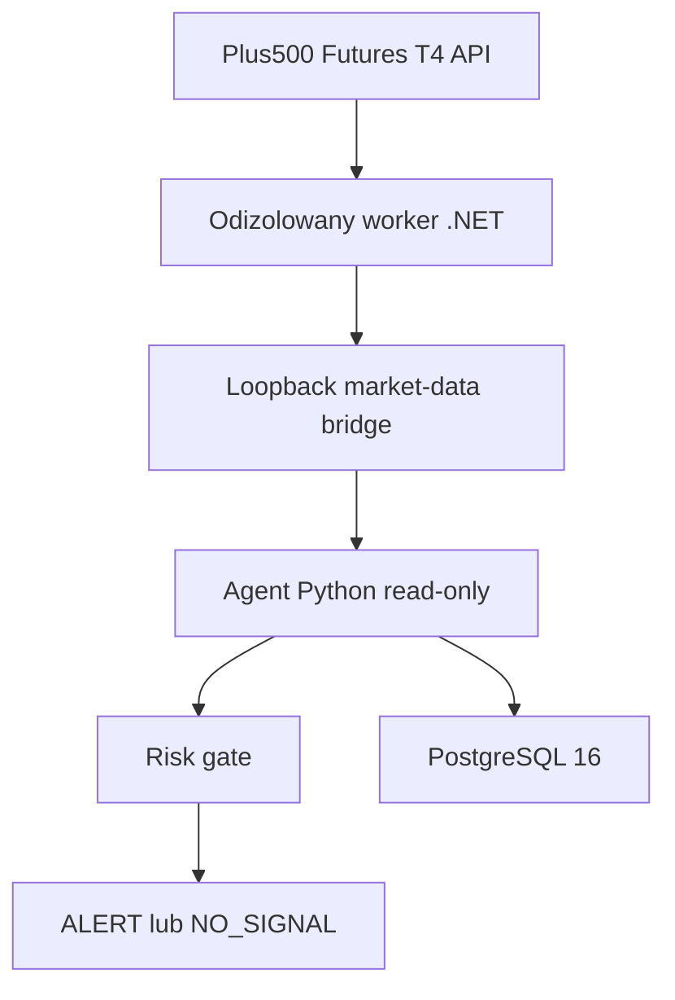

# Architektura T4-only

Worker .NET ma połączenie SSL do T4 i prywatne dane sesji. Agent Python widzi
jedynie znormalizowane świece, cenę referencyjną i metadane atestacji. Endpointy
zleceń nie mogą być wystawione przez most.

Most jest dostępny tylko przez loopback. Adapter odrzuca zdalny host, credentials
w URL, redirect, błędny source ID, niepełną historię i nie-UTC timestamps.

PostgreSQL rozdziela historię migracji od aktywnej polityki. `t4_runtime_config`
jest append-only i jednoznacznie wymusza wyłączone order routes.
