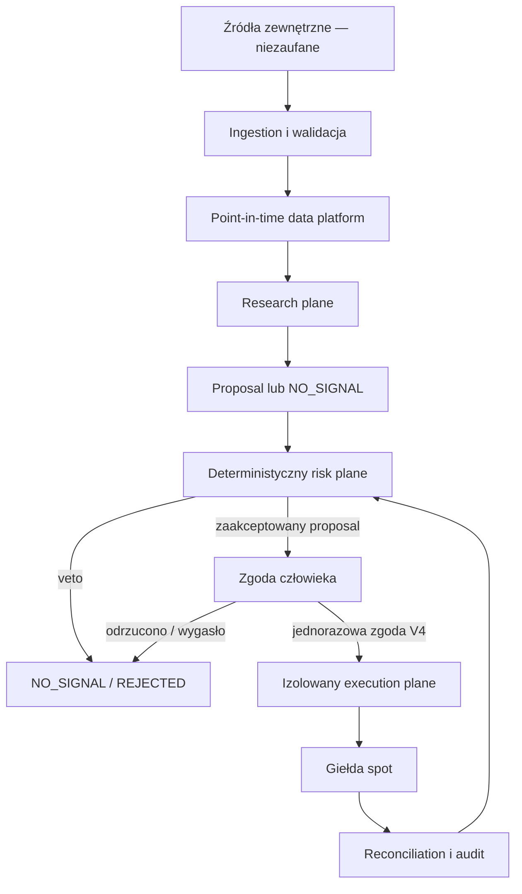
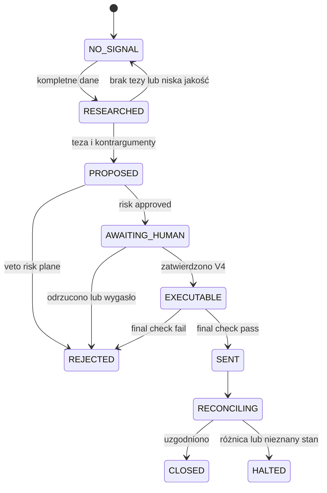
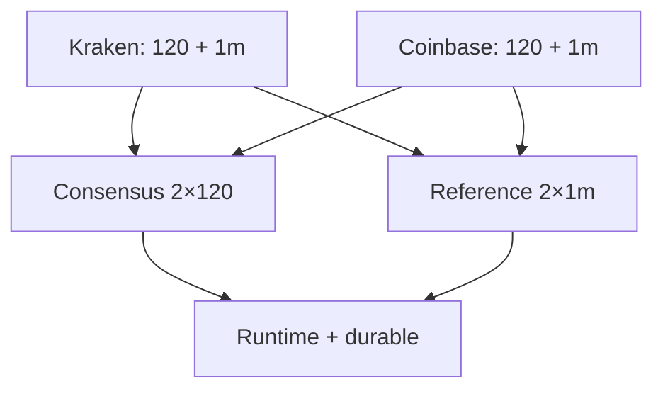

# Architektura Crypto Agent

> **Status implementacji:** dokument opisuje architekturę docelową V1–V4. Kod jest
> checkpointem `0.1.4 / V1.1`: dwa publiczne feedy spot, cross-source consensus i
> osobny dwuźródłowy snapshot ceny referencyjnej są zaimplementowane oraz testowane
> na fixture'ach. Research i risk pozostają logicznymi modułami jednego procesu, nie
> osobnymi usługami. Gate V1 jest niezaliczony, live contract tests i integracja z
> prawdziwym PostgreSQL nie zostały wykonane, a produkcja jest
> zablokowana do zamknięcia wszystkich kontroli z roadmapy.

## 1. Założenie nadrzędne

Crypto Agent jest systemem o rozdzielonych odpowiedzialnościach i granicach zaufania. Model językowy może wyszukiwać, porządkować i wyjaśniać informacje, ale nie jest źródłem prawdy liczbowej, kontrolerem ryzyka ani wykonawcą zleceń.

System składa się z trzech odseparowanych płaszczyzn:

1. **Research plane** — pozyskuje dane, buduje cechy, analizuje, tworzy scenariusze i proposal.
2. **Risk plane** — deterministycznie waliduje dane, oblicza ryzyko i ma bezwarunkowe prawo veta.
3. **Execution plane** — osobna, minimalna usługa techniczna, która może wykonać wyłącznie dokładnie zatwierdzone zlecenie w V4.

Domyślna odpowiedź całego systemu to `NO_SIGNAL`. Brak decyzji jest poprawnym i oczekiwanym wynikiem.

## 2. Widok wysokopoziomowy



W V1 i V2 execution plane nie istnieje. W V3 jego miejsce zajmuje paper broker bez prawdziwych kluczy. Dopiero V4 dopuszcza izolowany execution plane, a każda transakcja nadal wymaga zgody człowieka.

## 3. Granice zaufania

| Strefa | Poziom zaufania | Może | Nie może |
|---|---|---|---|
| Internet, social media, dokumenty | niezaufana | dostarczać kandydatów na fakty | sterować narzędziami, zmieniać polityki, wywołać transakcję |
| API giełd i dostawców danych | niezaufane dane wejściowe | dostarczać dane po walidacji | samodzielnie określać poprawności, tożsamości aktywa lub kompletności |
| Ingestion/quarantine | ograniczone zaufanie | normalizować, oznaczać i odrzucać dane | tworzyć sygnał lub wykonywać zlecenie |
| Point-in-time store | zaufanie warunkowe | udostępniać wersjonowane rekordy z provenance | nadpisywać historię bez śladu |
| Research plane / LLM | niezaufany decydent | analizować, cytować, tworzyć scenariusze i proposal | liczyć ryzyko, zmieniać limity, znać sekrety, składać zlecenia |
| Risk plane | wysoki poziom zaufania | liczyć, zatwierdzić albo zawetować proposal | obniżyć limit na polecenie modelu, wysłać zlecenie |
| Człowiek zatwierdzający | uprzywilejowana rola | zatwierdzić dokładny, niewygasły proposal w granicach risk policy | obejść veto, zmienić proposal w locie |
| Execution plane | najmniejszy możliwy zakres zaufania | wysłać dokładnie zatwierdzone zlecenie spot | analizować rynek, zwiększać ilość, wypłacać środki, ignorować TTL |
| Giełda/custodian | zewnętrzny kontrahent | przyjąć zlecenie i zwrócić status | być jedynym źródłem audytowym lub stanu strategii |

Najważniejsza zasada: **treść przekazana przez mniej zaufaną strefę jest danymi, nigdy instrukcją dla bardziej uprzywilejowanej strefy**.

## 4. Research plane

### 4.1. Odpowiedzialność

Research plane odpowiada za przygotowanie możliwej do zweryfikowania tezy. Nie podejmuje ostatecznej decyzji o ryzyku i nie ma dostępu do żadnego interfejsu handlowego.

### 4.2. Komponenty

- **Source registry:** lista źródeł, ich typ, opóźnienie, wiarygodność, licencja i polityka fallback.
- **Connectors read-only:** market data, order book, derivatives analytics, on-chain, makro, tokenomics, governance, regulacje i dokumenty.
- **Normalizer:** kanoniczne identyfikatory, jednostki, strefy czasowe, decimal precision i corporate/token events.
- **Data-quality engine:** freshness, kompletność, rozjazd źródeł, outliery, luki, quarantine i ocena jakości.
- **Point-in-time store:** niezmienne dane surowe, kolejne rewizje oraz informacja, kiedy rekord stał się dostępny.
- **Feature pipeline:** deterministyczne wyliczenia trendu, zmienności, płynności, spreadu, basis, OI, on-chain i tokenomics.
- **Specialists:** reżim/makro, market structure, derivatives, on-chain, tokenomics, bezpieczeństwo protokołów oraz regulacje/news.
- **Sceptyk:** obowiązkowo wyszukuje sprzeczne dowody, alternatywne wyjaśnienia i ryzyka ukryte.
- **Orchestrator:** zleca analizy, łączy wyniki i pilnuje schematu; nie może ominąć risk plane.
- **Evidence service:** wiąże twierdzenia z konkretnymi źródłami i snapshotami.
- **Decision formatter:** zwraca wyłącznie walidowany `NO_SIGNAL`, `ALERT`, raport albo proposal właściwy dla aktualnej wersji systemu.

### 4.3. Reguły działania LLM

- LLM otrzymuje tylko dane potrzebne do zadania i dokumenty oczyszczone z aktywnej treści narzędziowej.
- Instrukcje znalezione w dokumentach są ignorowane i oznaczane jako potencjalny prompt injection.
- Każde twierdzenie o wysokim wpływie wymaga źródła pierwotnego lub zgodności kilku niezależnych źródeł.
- Model przedstawia kontrargumenty i warunki unieważnienia, zamiast jednej pewnej prognozy.
- LLM nie tworzy „pewności 92%”. Liczby prawdopodobieństwa pochodzą wyłącznie ze skalibrowanego modelu ilościowego.
- LLM nie wykonuje arytmetyki finansowej istotnej dla decyzji; korzysta z wyników zwalidowanych funkcji.

### 4.4. Uprawnienia

Research plane posiada tylko:

- odczyt zatwierdzonych źródeł;
- odczyt point-in-time store;
- zapis raportów, trace’ów i proposalów do kolejki pośredniej;
- brak sieciowej trasy do endpointów składania zleceń;
- brak sekretów tradingowych i withdrawal.

## 5. Deterministyczny risk plane

### 5.1. Rola

Docelowo risk plane jest samodzielnym kontrolerem bezpieczeństwa. Otrzymuje proposal i
niezależnie sprawdza dane, limity oraz stan portfela. W checkpointcie V1.1 jest osobnym,
deterministycznym modułem w tym samym procesie i wiąże wynik z hashem snapshotu oraz
pełnym fingerprintem polityki. Provider konsensusu jest zapieczętowany na source keys
`kraken_spot_rest_v1` + `coinbase_exchange_spot_rest_v1`, a zmiana składu po
skonstruowaniu unieważnia dowód. Kod, krytyczne mapy, origin i transport są
rewalidowane przed i po fetchu. Jest to defense-in-depth wobec znanych/przypadkowych
mutacji, nie sandbox dla arbitralnego kodu w tym samym interpreterze. Separacja
usługowa i niezależny odczyt snapshotu są warunkiem kolejnej bramki.

Statusy zależą od wersji:

- V1: wynik badawczy `NO_SIGNAL | ALERT`, a risk assessment może go zawetować;
- V2: ten sam kontrakt oceniany w replayu point-in-time;
- V3: dodatkowo `PAPER_PROPOSAL | VETO`, bez prawdziwego wykonania;
- V4: `APPROVED_FOR_HUMAN_REVIEW | VETO`; samo approval nadal nie wykonuje zlecenia.

Veto jest ostateczne i nie podlega negocjacji z LLM.

### 5.2. Dlaczego deterministyczny

- Identyczne wejście i wersja polityki muszą dawać identyczny wynik.
- Każda reguła ma testy jednostkowe i wartości graniczne.
- Obliczenia używają jawnej precyzji dziesiętnej, jednostek i zasad zaokrąglania.
- Kod polityki jest wersjonowany i wdrażany oddzielnie od promptów/modeli.
- Zmiana limitów wymaga przeglądu i zatwierdzenia poza ścieżką pojedynczej decyzji.

### 5.3. Obowiązkowe kontrole

1. **Tożsamość instrumentu:** venue, symbol, typ spot, sieć/adres kontraktu i allowlista.
2. **Czas i jakość:** freshness, kompletność, clock skew, jakość i zgodność źródeł.
3. **Rynek:** spread, głębokość, volatility, price impact, trading status i price collar.
4. **Proposal:** schemat, wersja, TTL, idempotency key, warunki unieważnienia i brak modyfikacji.
5. **Portfel:** cash, istniejąca ekspozycja, koncentracja, korelacja i dostępne saldo.
6. **Limity:** per zlecenie, aktywo, giełda, dzień, obrót, strata i drawdown.
7. **Operacje:** stan feedów, giełdy, reconciliation, kill switch, incydenty i tryb systemu.
8. **Wersja:** zgodność proposal, modelu, danych i polityki z zatwierdzonym release’em.

### 5.4. Warunki automatycznego veto

- brak danych krytycznych, zbyt stare dane lub rozjazd źródeł powyżej progu;
- nieznany identyfikator, token poza allowlistą albo instrument inny niż spot w V4;
- nieskalibrowane prawdopodobieństwo użyte do sizingu;
- przekroczony dowolny limit ekspozycji, straty, obrotu lub drawdown;
- szeroki spread, niewystarczająca głębokość albo przekroczony price impact;
- proposal wygasł, został zmodyfikowany, nie ma provenance lub nie przeszedł Sceptyka;
- aktywny kill switch, brak reconciliation albo niejednoznaczny status poprzedniego zlecenia;
- brak wymaganej zgody człowieka lub niezgodność jej podpisu/parametrów;
- błąd wewnętrzny, timeout albo nieznany stan.

**Fail closed:** każdy nieobsłużony wyjątek risk plane ma wynik `VETO`, nigdy domyślne zatwierdzenie.

### 5.5. Izolacja

Risk plane:

- pobiera snapshot kontrolny niezależnie od research plane;
- odczytuje ledger i politykę, ale nie ma klucza do składania zleceń;
- publikuje podpisany wynik z hashem proposal i krótkim TTL;
- zapisuje kod przyczyny każdej decyzji;
- nie przyjmuje instrukcji w języku naturalnym jako zmiany polityki.

## 6. Execution plane

### 6.1. Dostępność według wersji

| Wersja | Execution plane |
|---|---|
| V1 | nie istnieje; tylko raporty i alerty |
| V2 | nie istnieje; wyłącznie historyczny simulator |
| V3 | paper broker bez prawdziwych kluczy i kapitału |
| V4 | osobna usługa canary, spot bez dźwigni, każda transakcja zatwierdzona przez człowieka |

### 6.2. Odpowiedzialność w V4

Execution plane nie interpretuje tezy i nie podejmuje decyzji. Wykonuje wąską komendę tylko wtedy, gdy jednocześnie posiada:

1. niewygasły, niezmieniony proposal;
2. podpisane `APPROVED_FOR_HUMAN_REVIEW` z risk plane;
3. jednorazową zgodę człowieka na dokładnie te parametry;
4. aktywny tryb canary i brak kill switcha;
5. aktualny final pre-trade check ceny i salda.

### 6.3. Minimalne uprawnienia i zabezpieczenia

- Klucz API przypisany do oddzielnego subkonta i konkretnego IP/workload identity.
- Uprawnienie wyłącznie do spot trading; wypłaty i transfery wyłączone.
- Sekret dostępny tylko w runtime execution plane, nigdy w logu, bazie proposalów ani kontekście modelu.
- Idempotency i unikalny client order ID blokują duplikaty.
- Limit ceny/price collar i maksymalna ilość nie mogą być zwiększone przez wykonawcę.
- Timeout lub niejednoznaczna odpowiedź giełdy prowadzi do sprawdzenia statusu i blokady, nie do ślepego retry.
- Reconciliation porównuje lokalny ledger z orders, fills, fees i balances giełdy.
- Manualny i automatyczny kill switch działa niezależnie od research plane.

## 7. NO_SIGNAL jako stan domyślny

### 7.1. Znaczenie

`NO_SIGNAL` nie oznacza błędu systemu. Oznacza, że aktualne dowody, jakość danych albo relacja potencjalnego wyniku do ryzyka nie uzasadniają dalszego działania.

System zaczyna każdy cykl w stanie `NO_SIGNAL`. To research plane musi dostarczyć kompletny proposal, a następnie przejść wszystkie bramki. Brak spełnienia choćby jednej bramki pozostawia system w `NO_SIGNAL` lub kończy go jako `REJECTED`.

### 7.2. Przykładowe kody powodów

| Kod | Znaczenie |
|---|---|
| `INSUFFICIENT_EVIDENCE` | brak wystarczającej przewagi dowodowej |
| `LOW_DATA_QUALITY` | jakość danych poniżej progu |
| `STALE_DATA` | dane utraciły ważność |
| `SOURCE_CONFLICT` | źródła krytyczne są sprzeczne |
| `REGIME_UNCERTAIN` | klasyfikacja reżimu jest zbyt niepewna |
| `LIQUIDITY_INSUFFICIENT` | spread, głębokość lub impact są nieakceptowalne |
| `RISK_LIMIT` | proposal przekracza limit polityki |
| `EVENT_RISK` | aktywne zdarzenie uniemożliwia wiarygodną ocenę |
| `MODEL_OOD` | dane są poza zakresem znanym modelowi |
| `SYSTEM_DEGRADED` | system, feed, ledger lub giełda działa w trybie zdegradowanym |
| `APPROVAL_MISSING` | brak wymaganej zgody człowieka |
| `PROPOSAL_EXPIRED` | proposal lub jego zatwierdzenie wygasło |

### 7.3. Maszyna stanów decyzji



Stany od `AWAITING_HUMAN` do `CLOSED` są dostępne dopiero w V4. W V3 `PROPOSED` przechodzi wyłącznie do paper brokera.

## 8. Przepływ danych

### 8.1. Ingestion

Każdy rekord musi zawierać co najmniej:

- `source_id` i identyfikator surowej odpowiedzi;
- `asset_id`/`instrument_id` w kanonicznym formacie;
- `event_time` — kiedy zdarzenie wystąpiło;
- `published_at` — kiedy źródło je opublikowało;
- `received_at` — kiedy system odebrał odpowiedź;
- `available_at` — od kiedy rekord wolno użyć w decyzji;
- `ingested_at` — kiedy zapisano go w platformie;
- wersję schematu, checksum i flagi jakości.

Dane surowe są append-only. Korekta tworzy nową wersję, nie usuwa starej. Dzięki temu backtest i audyt widzą dokładnie taką informację, jaka była dostępna w danym momencie.

### 8.2. Konsensus i trwały recompute w checkpointcie V1.1

Ścieżka publiczna ma dwie z góry przypięte granice sieciowe: Kraken i Coinbase.
Adaptery dopuszczają wyłącznie oczekiwane hosty HTTPS i odrzucają redirect zamiast za
nim podążać. Provider nie akceptuje aliasów, podklas ani dwóch źródeł reprezentujących
to samo venue. Jego konfiguracja, implementacja i fingerprint polityki są zamrażane
oraz ponownie sprawdzane przed i po fetchach.

Runtime i persistence korzystają z jednego czystego, wersjonowanego algorytmu
`cross_exchange_spot_consensus_v1`. Wejściem jest dokładnie 120 ciągłych i wyrównanych
czasowo świec z każdego źródła, zakończonych najnowszym kwalifikującym się zamkniętym
oknem. Luka, brak jednego feedu, różny koniec, konflikt OHLC/close albo niezgodna
anomalia wolumenu kończą się `NO_SIGNAL`; nie ma degradacji do pojedynczego źródła.

Cena referencyjna jest oddzielona od tej historii. Każde venue dostarcza dokładnie
ostatnią zamkniętą świecę 1m z tego samego okna UTC. Czysty algorytm
`cross_exchange_reference_price_v1` sprawdza exact source→venue, lineage,
`event_time <= cutoff_as_of <= evaluated_at`, wiek do 300 s oraz maksymalnie 50 pb
każdego źródła od midpoint mediany. RiskGate ponownie wykonuje tę kontrolę i wiąże raw
observations z fingerprintem wejścia.

W trwałej ścieżce repozytorium, a nie caller, wyznacza latest eligible revision dla
każdego wymaganego source/window według cutoffu. Opcjonalna lista IDs od callera jest
wyłącznie assertion równości z wyprowadzonym zbiorem. Repozytorium sprawdza dokładną
parę pinned źródeł i venue, pełny fingerprint `RiskPolicy`, ciągłość `2 × 120`, po czym
uruchamia ten sam algorytm i porównuje wynik z draftem.

Canonical zapisuje OHLC i pełne uporządkowane provenance. Bezwymiarowy normalized
volume, evidence digest, role wejść, okno oraz diagnostyka pozostają w niezmiennym
manifeście; `candles.base_volume` jest `NULL`, ponieważ wartość po normalizacji nie jest
wolumenem bazowym żadnego venue.

Migracja `0012` zapisuje referencję w append-only `reference_price_manifests` i
`reference_price_provenance`. Repozytorium wyprowadza z bazy najnowsze dokładne 2×1,
przypina `candle_id` wraz z `source_candle_receipt_id`, a deferred trigger ponownie
liczy medianę, divergence, świeżość i pełny eligible revision universe przy COMMIT.
Archiwalna polityka schema-r1 jest dozwolona tylko dla historycznego odczytu; nowe
manifesty wymagają schema-r2.

Ta ścieżka została sprawdzona na fakes i statycznie. Nie wykonano jej jeszcze na
prawdziwym PostgreSQL 16; nie ma też operacyjnego raw-payload ingestu, quarantine,
operacyjnego schedulera. Health pozostaje fail-closed jako `SEEDS_MISSING`,
dopóki wymagany registry footprint nie zostanie jawnie utworzony.



### 8.3. Od danych do proposalu

1. Connector zapisuje surową odpowiedź wraz z czasami i checksum.
2. Walidator sprawdza schemat, jednostki, symbol, świeżość i duplikaty.
3. Podejrzane rekordy trafiają do quarantine; nie są widoczne dla feature pipeline.
4. Normalizer mapuje je na kanoniczny instrument i zapisuje wersję point-in-time.
5. Deterministyczny pipeline oblicza cechy z odcięciem `available_at <= as_of`.
6. Specjaliści analizują wyłącznie snapshot odpowiadający `as_of`.
7. Sceptyk dodaje dowody przeciw i możliwe przyczyny błędu.
8. Formatter waliduje wynik. Jeśli brakuje pola krytycznego, zwraca `NO_SIGNAL`.
9. Proposal trafia do niezmiennej kolejki, nigdy bezpośrednio do wykonania.

### 8.4. Od proposalu do zlecenia w V4

1. Risk plane pobiera proposal i sprawdza jego hash, wersję oraz TTL.
2. Niezależnie pobiera snapshot ceny, płynności, ledger i stan limitów.
3. Uruchamia policy-as-code; wynik to veto lub proposal kwalifikujący się do oceny człowieka.
4. Człowiek widzi pełne parametry i zatwierdza je jednorazowo z MFA albo odrzuca.
5. Execution plane porównuje hash proposal, risk approval i human approval.
6. Final pre-trade check ponownie sprawdza TTL, saldo, cenę, spread, kill switch i idempotency.
7. Usługa wysyła dokładnie jedno zlecenie i zapisuje surową odpowiedź giełdy.
8. Reconciliation uzgadnia status, fill, fee, saldo i ledger; rozbieżność zatrzymuje nowe zlecenia.

## 9. Kontrakt decyzji

Minimalny logiczny kontrakt wyniku:

```json
{
  "decision_id": "uuid",
  "as_of": "2026-08-10T10:00:00Z",
  "expires_at": "2026-08-10T10:15:00Z",
  "asset_id": "bip122:000000000019d6689c085ae165831e93:native",
  "instrument_id": "kraken_spot_rest_v1:BTC/USD:240m",
  "horizon": "4h",
  "decision": "NO_SIGNAL",
  "reason_codes": ["INSUFFICIENT_EVIDENCE"],
  "regime_probabilities": [],
  "thesis": "",
  "counter_evidence": [],
  "scenarios": [],
  "invalidation_conditions": [],
  "data_quality": {
    "score": 0.0,
    "flags": [],
    "critical_flags": []
  },
  "risk": {
    "decision": "NO_SIGNAL",
    "vetoed": true,
    "flags": []
  },
  "sources": [],
  "model_version": "",
  "policy_version": "",
  "data_snapshot_id": "",
  "trace_id": ""
}
```

Dla proposal dochodzą pola kierunku, typu zlecenia, limitu ceny, maksymalnej ilości i maksymalnej tolerowanej straty. Research plane może je proponować, lecz tylko risk plane wylicza i zatwierdza ich dopuszczalne wartości.

## 10. Dane, sekrety i audyt

### Dane

- Raw, normalized, features, decisions, approvals, orders i audit logs są odseparowanymi zbiorami.
- Dostęp jest nadawany zgodnie z zasadą najmniejszych uprawnień.
- Dane treningowe są oddzielone od validation, holdout i forward evaluation.
- Retencja musi pozwolić odtworzyć każdą decyzję, ale nie może utrwalać sekretów.

### Sekrety

- Klucze są przechowywane w secret managerze, rotowane i przypisane do workload identity.
- Research i risk plane nie mogą odczytać sekretu tradingowego.
- Klucz V4 nie ma prawa wypłat i jest ograniczony do subkonta/IP.
- Development, V3 paper i V4 canary używają całkowicie różnych poświadczeń.

### Audit

Audyt decyzji musi odtworzyć:

- wersję kodu, modelu, promptu i polityki;
- dokładny snapshot danych oraz ich provenance;
- wyniki każdego specjalisty i Sceptyka;
- wszystkie obliczenia i powody risk veto/approval;
- tożsamość i dokładny zakres zgody człowieka;
- request, response, status, fills, fees i reconciliation giełdy.

Log audytowy jest append-only i chroniony przed modyfikacją. Dane wrażliwe są redagowane przed zapisem.

## 11. Odporność i tryby awaryjne

System działa według reguły fail closed:

- niedostępny feed → `NO_SIGNAL`;
- niespójne źródła → quarantine i `NO_SIGNAL`;
- timeout modelu → brak proposalu;
- wyjątek risk plane → veto;
- wygasła zgoda → brak zlecenia;
- timeout giełdy → reconciliation i blokada retry;
- rozbieżność salda → kill switch;
- utrata audit logu lub zegara → blokada nowych decyzji/zleceń;
- wykryty prompt injection → izolacja dokumentu i alert bezpieczeństwa.

Minimalne testy odporności obejmują awarie pojedynczego źródła, opóźnione dane, clock skew, duplikaty eventów, reconnect, częściowy fill, nieznany status zlecenia, rate limit, restart w trakcie procesu i równoczesne proposal’e na ten sam limit.

## 12. Wdrożenie i separacja środowisk

Środowiska `development`, `backtest`, `paper` i `canary` są oddzielne pod względem danych, kont, sekretów, kolejek i polityk dostępu. Artefakt modelu i kod są promowane między środowiskami po bramce, a nie budowane ponownie bez śladu.

Zalecane niezależne jednostki wdrożeniowe:

- ingestion/connectors;
- data-quality i normalization;
- point-in-time storage oraz feature pipeline;
- research orchestrator i specjaliści;
- evidence/decision service;
- risk engine;
- approval service;
- paper broker albo execution service;
- ledger/reconciliation;
- monitoring/audit.

Awaria jednej jednostki nie może rozszerzyć uprawnień innej. Szczególnie research plane nie może zostać uruchomiony z rolą execution plane.

## 13. Niezmienne właściwości bezpieczeństwa

Architektura jest poprawna tylko wtedy, gdy zawsze spełnia następujące warunki:

1. Nie istnieje ścieżka z tekstu zewnętrznego do zlecenia bez walidacji, risk approval i zgody człowieka.
2. Veto risk plane nie może zostać nadpisane.
3. Brak lub niepewność danych prowadzi do `NO_SIGNAL`.
4. LLM nigdy nie posiada klucza tradingowego ani withdrawal.
5. Execution plane nie może zwiększyć zakresu zatwierdzonego proposal.
6. Każde zlecenie V4 odpowiada jednemu, dokładnemu i niewygasłemu zatwierdzeniu człowieka.
7. Każda decyzja i transakcja jest reprodukowalna i audytowalna.
8. Każdy nieznany stan kończy się zatrzymaniem lub blokadą, nie zgadywaniem.
9. V4 pozostaje spot-only, bez dźwigni i z minimalnym kapitałem canary.
10. Wynik finansowy nigdy nie upoważnia do automatycznego poluzowania limitów.
