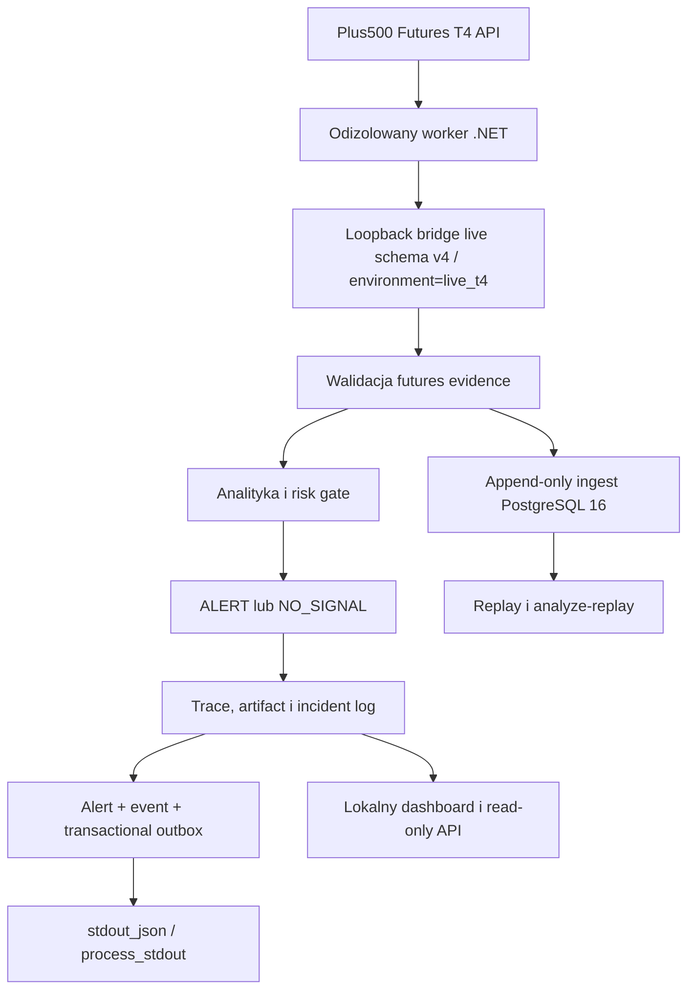

# Architektura T4-only

Worker .NET jest przygotowaną granicą dla połączenia SSL do T4 i prywatnych danych
sesji. Oficjalny klient nie jest jeszcze podłączony: bieżący
`T4ApplicationRegistrationPendingReader` zwraca `503`. Agent Python widzi jedynie
znormalizowane dane rynkowe i metadane atestacji. Endpointy zleceń nie mogą być
wystawione przez most.

Most jest dostępny tylko przez loopback i wymaga osobnego tokenu. Adapter odrzuca
zdalny host, credentials w URL, redirect, błędny source ID, brak rzeczywistego
contract ID, wygasły kontrakt, niepełną historię i nie-UTC timestamps.

Katalog kontraktów jest wczytywany lokalnie przez worker. Resolver sortuje serie
według wygaśnięcia, używa front-month wyłącznie przed jego `roll_at` i od tej
granicy wymaga następnej bezpiecznej serii. Historyczny payload schema v3
przenosi `contract_roll_at`, typ wyboru, `rolled_from_contract_id` oraz
`futures_evidence`. Bieżący kontrakt live schema v4 zachowuje te dowody i dodaje
wymaganą atestację `environment=live_t4`. Evidence wiąże batch z pełnym snapshotem
order booka, statusem sesji, typed basis reference i opcjonalnym dowodem przejścia
kontraktu.

Oficjalna dokumentacja wymaga rejestracji aplikacji przed logowaniem do T4 API.
Dlatego host pozostaje `NOT_READY` i zwraca `503`, dopóki oficjalny klient nie
zostanie podłączony. Ten stan prowadzi w agencie do `NO_SIGNAL` i lokalnego,
deduplikowanego incydentu. Fixture’y testowe nie są źródłem live i nie omijają tej
granicy.

PostgreSQL rozdziela historię migracji od aktywnej polityki. `t4_runtime_config`
jest append-only i jednoznacznie wymusza wyłączone order routes.

Warstwa 0.5.0 zapisuje dokładne bajty odpowiedzi bridge’a wraz z SHA-256 oraz
znormalizowane świece w jednej transakcji. Konflikt identycznego hasha zwraca
istniejący batch, nie tworząc kolejnych świec. Replay otwiera transakcję tylko do
odczytu i uwzględnia wyłącznie rekordy znane w zadanym `as_of`; brak pełnego okna
kończy się `T4_REPLAY_INCOMPLETE`, a nie częściowym wynikiem.

Warstwa 0.6.0 waliduje schema v3 i oblicza deterministycznie spread, depth,
imbalance, basis, annualized basis, metryki wolumenu, ryzyko expiry i wpływ rollu.
Basis może korzystać wyłącznie z referencji typu `index` o source ID
`plus500_t4_index_v1`; zwykła cena futures nie może jej zastąpić. Brak, stary lub
niespójny dowód kończy się `NO_SIGNAL`.

Migracja `0015` zapisuje snapshot, poziomy order booka i dowód przejścia kontraktu
jako append-only, wraz z hashami kanonicznej treści. Point-in-time replay odtwarza
ten sam evidence i obejmuje go fingerprintem wejścia; `analyze-replay` przepuszcza
go przez ten sam silnik co analiza bieżąca. Historyczne batche schema v2 i v3 są
nadal odczytywalne. V2 bez futures evidence nie może przejść bramki analitycznej;
v3 może odtworzyć analizę, lecz replay nigdy nie uzyskuje kwalifikacji do external
delivery.

Warstwa 0.7.0 nadaje kanoniczny `trace_id` przed analizą, zapisuje bezpieczny
artifact raportu, przebieg runu i incydenty w istniejącym modelu badawczym.
Provider error, timeout albo odrzucony raport są rejestrowane bez surowego wyjątku,
URL, nagłówków, credentials lub pełnego payloadu dostawcy.

Tylko niewygasła decyzja `ALERT` z operacji live T4, bridge schema v4,
`environment=live_t4`, zatwierdzoną proweniencją, kompletnym futures evidence i
przejściem risk gate może utworzyć delivery outbox.
`NO_SIGNAL`, veto, dane stare, synthetic, fixture i replay nigdy nie są kierowane
do dostarczenia. Migracja `0016` dodaje immutable outbox i append-only próby
dostarczenia z idempotency key, hashami payloadu, łańcuchem hashy prób, limitem
prób, backoffem oraz terminalnym stanem po dostarczeniu, błędzie lub expiry.

Granica atomowości monitoringu obejmuje w PostgreSQL: research run/artifact,
alert, alert event oraz outbox utworzone w jednej transakcji. SQLite pozostaje
osobnym historycznym magazynem raportów; system nie deklaruje transakcji
rozproszonej pomiędzy SQLite i PostgreSQL.

Delivery jest celowo lokalne: jedyna trasa to `stdout_json` → `process_stdout`.
Nie istnieje dowolny webhook ani integracja Slack, Telegram, e-mail lub SMS.
Trwały outbox daje semantykę at-least-once; odbiorca stdout deduplikuje po
`idempotency_key`, ponieważ granica procesu nie zapewnia exactly-once.
Dashboard jest statycznym HTML bez JavaScriptu, formularzy, linków i zasobów
zdalnych. API działa wyłącznie na loopback, bez CORS i bez endpointów dokumentacji,
oraz dodaje restrykcyjne nagłówki bezpieczeństwa. Analiza, która zapisuje trace,
jest wyłącznie operacją `POST /v1/analyze` i wymaga nagłówka
`X-Crypto-Agent-Request: analyze-v1`; nie ma wariantu GET z efektem ubocznym.

`v1_gate_passed=false`; następną warstwą jest odbiór z punktu 8, w tym test live T4
i minimum cztery tygodnie obserwacji read-only.
